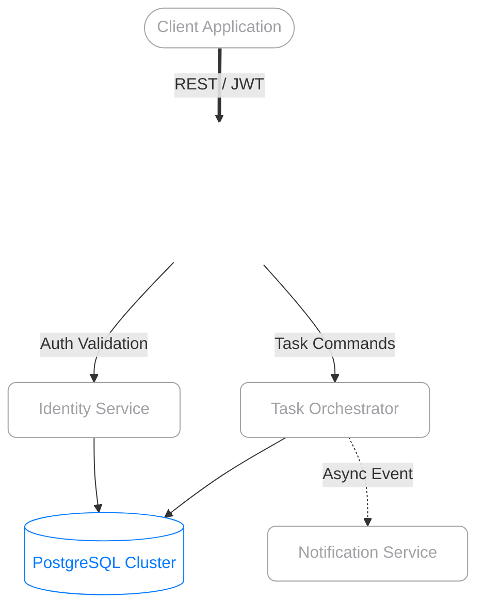

<div align="center">
  
  <br>
  

  <br>
  
  <h1 style="color: #FFFFFF; font-family: -apple-system, BlinkMacSystemFont, 'Segoe UI', Roboto, Helvetica, Arial, sans-serif;">
    <b>TASK SCHEDULER</b>
  </h1>
  <p style="color: #A1A1A6;"><i>Backend-For-Frontend Gateway & Microservices Ecosystem</i></p>

  <a href="https://github.com/pedroforbeck">
    <!-- Apple System Font (San Francisco) & Titanium Silver Color -->
    
  </a>

  <br><br>

  <!-- Core Tech Stack (Space Gray Aesthetic) -->
  
  
  
  
  

  <br><br>

  <!-- Architecture Badges (Space Gray Aesthetic) -->
  
  

</div>

<br><br>

> **Abstract**<br>
> This repository serves as the **Backend-For-Frontend (BFF)** and core **API Gateway** for a distributed Task Scheduling ecosystem. It abstracts the underlying microservices complexity, orchestrates network traffic, and enforces global security policies (JWT & RBAC) before any request reaches the internal domain services.

<br>

##  Table of Contents

- [Ecosystem Architecture](#-ecosystem-architecture)
- [Core Capabilities](#-core-capabilities)
- [System Demonstration](#-system-demonstration)
- [Deployment & Orchestration](#-deployment--orchestration)
  - [1. Docker Deployment](#1-docker-deployment)
  - [2. Workspace Initialization](#2-workspace-initialization)
  - [3. Bootstrapping Services](#3-bootstrapping-services)
- [API Reference](#-api-reference)

---

##  Ecosystem Architecture

Instead of a monolithic approach, the domain is strictly decoupled into focused microservices. This ensures high availability, isolated horizontal scaling, and strict separation of concerns.

| Component | Port | Designation | Repository Link |
| :--- | :---: | :--- | :--- |
| **BFF / Gateway** | `8080` | Entry node. Handles authentication validation and request routing. | *(Current Repository)* |
| **User Service** | `8081` | Identity Provider (IdP). Manages credentials and JWT issuance. | [pedroforbeck/usuario](https://github.com/pedroforbeck/usuario) |
| **Task Service** | `8082` | Core Engine. Manages task state machines and cron execution. | [pedroforbeck/agendador-tarefas](https://github.com/pedroforbeck/agendador-tarefas) |
| **Notification** | `8083` | Event Listener. Dispatches asynchronous alerts based on task states. |[pedroforbeck/notificacao](https://github.com/pedroforbeck/notificacao) |

<br>

<details>
<summary><b style="color: #A1A1A6; cursor: pointer;">View System Topology (Glass/Wireframe Diagram)</b></summary>
<br>


</details>

---

##  Core Capabilities

| Feature | Description |
| :--- | :--- |
|  **Stateless Auth** | Secure session management utilizing signed JSON Web Tokens (JWT). |
|  **RBAC Security** | Granular endpoint protection ensuring strict data privacy and authorization. |
|  **Automated Cron** | Resilient execution of scheduled tasks leveraging Spring's internal scheduling algorithms. |
|  **BFF Pattern** | Aggregates and tailors data responses specifically for the client interface. |
|  **Event-Driven** | Decoupled asynchronous notifications triggered dynamically by task lifecycle events. |

---

##  System Demonstration

<!-- Recording -->
<div align="center">
  
  <br><br>
  <p style="color: #A1A1A6;"><i>Interactive API documentation and workflow testing via Swagger UI.</i></p>
</div>

---

##  Deployment & Orchestration

### 1. Docker Deployment
For a streamlined, containerized approach, you can easily pull the pre-built application image directly from the Docker registry:

```bash
docker pull pedroforbeck/bff-agendador-tarefas:latest
```

> **Registry & Resources:**
> *  **Docker Hub:**[pedroforbeck/bff-agendador-tarefas](https://hub.docker.com/repository/docker/pedroforbeck/bff-agendador-tarefas/general)
> *  **Source Code:** [GitHub Repository](https://github.com/pedroforbeck/bff-agendador-tarefas)

<br>

### 2. Workspace Initialization
To run the ecosystem locally from source, all microservices must be instantiated in the correct sequence. Ensure you have **Java 17+**, **Maven 3.8+**, and **PostgreSQL** installed.

Create an isolated directory and clone the complete ecosystem repository suite:

```bash
mkdir task-scheduler-ecosystem && cd task-scheduler-ecosystem

# Clone underlying services
git clone https://github.com/pedroforbeck/usuario.git
git clone https://github.com/pedroforbeck/agendador-tarefas.git
git clone https://github.com/pedroforbeck/notificacao.git

# Clone the Gateway (BFF)
git clone https://github.com/pedroforbeck/bff-agendador-tarefas.git
```

### 3. Bootstrapping Services
Ensure your PostgreSQL instance is running and the required databases are created. Open separate terminal instances for each service and execute them in the following order:

**Terminal A: Identity Provider**
```bash
cd usuario
./mvnw spring-boot:run
```

**Terminal B: Task Engine**
```bash
cd agendador-tarefas
./mvnw spring-boot:run
```

**Terminal C: Notification Listener**
```bash
cd notificacao
./mvnw spring-boot:run
```

**Terminal D: BFF Gateway (Entrypoint)**
```bash
cd bff-agendador-tarefas
./mvnw spring-boot:run
```

> **Note on Environment Variables:** 
> The BFF Gateway (`application.properties`) requires the following configurations to route traffic successfully. Adjust them according to your local setup:
> ```properties
> server.port=8080
> jwt.secret=<YOUR_SECURE_256_BIT_KEY>
> service.usuario.url=http://localhost:8081
> service.agendador.url=http://localhost:8082
> ```

---

##  API Reference

The ecosystem implements **OpenAPI 3.0** specifications. Once the BFF Gateway is active, the complete schema and interactive UI are exposed at:

* **Swagger UI:** [`http://localhost:8080/swagger-ui.html`](http://localhost:8080/swagger-ui.html)
* **Raw JSON Schema:**[`http://localhost:8080/v3/api-docs`](http://localhost:8080/v3/api-docs)

---

<div align="center">
  <br>
  <p style="color: #A1A1A6;">Architected and maintained by <b><a href="https://github.com/pedroforbeck" style="color: #A1A1A6; text-decoration: none;">Pedro Forbeck</a></b>.</p>
  <p>
    <a href="https://github.com/pedroforbeck">
      
    </a>
    <a href="https://www.linkedin.com/in/pedro-forbeck-180a98390/">
      
    </a>
  </p>
</div>
